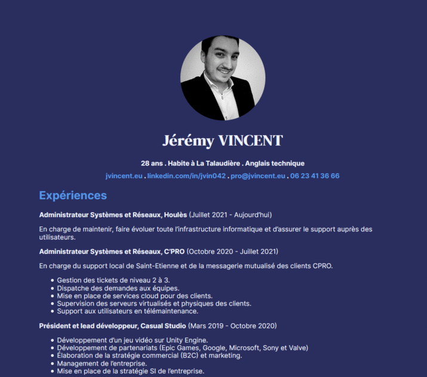

# Markdown Resume
> The easiest way to make a simple and effective resume!

<p align="center">
  
</p>

Changing the content or style of a CV is a relatively common occurrence that can be frustrating. This repo contains starter files for the simplest possible where resume *content* is maintained in a simple markdown file and generating `.html` and `.pdf` output formats can be automated with two tools: `pandoc` and `wkhtmltopdf`.

White and Dark Theme.

**Still trying to decide if this is the repo for you? Here are the original markdown files and the two output files for your persual**: 

[Markdown - Resume](src/resume.md) . [Markdown - Footer](src/footer.md) . [HTML generate Pandoc](index.html) . [PDF](resume.pdf) . [Preview Light](https://resume.jvincent.eu) . [Preview Dark](https://resume.jvincent.eu/dark)

Use pandoc to convert .md to .html, with styling via a .css file.

Use wkhtmltopdf to print .html as .pdf.

## Build Resume
```sh
./build.sh
```

Fork repo and edit your resume!